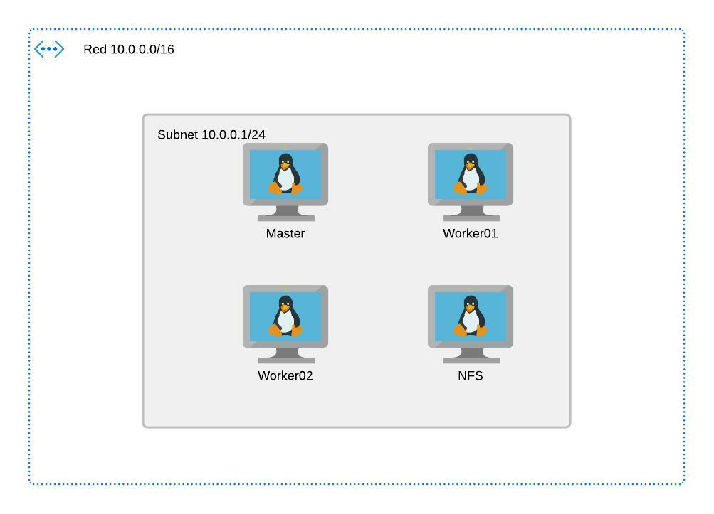

#  Objetivo del projecto
 
Automatización despliegue  de INFRA en Azure con TERRAFORM y despliegue de Kubernetes y aplicaciones con ANSIBLE 
- **Terraform**, como herramienta de código para el despliegue de infraestructura y
- **Ansible** como software de gestión de configuración y despliegue de aplicaciones y 

# Terraform
## Arquitectura a desplegar en Terraform



##  Comandos para el despliegue de la arquitectura de Terraform en Azure

1. Clonamos este repositorio y accedemos a la carperta terraform
```console
XXX@Azure: git clone https://github.com/borjary/UnirCasoPraccticoTwo
XXX@Azure: cd UnirCasoPraccticoTwo/Terraform
```
2. Se debe generar un archivo credentials.tf con lso datos necesarios para poder desplegar en azure

3. Lanzamos un terraform init para que se descargue el provider de azure
```console
XXX@Azure: terraform init 
```

4. Generamos un plan de Terraform 
```console
XXX@Azure: terraform plan 
```

5. Desplegamos la infraestructura de Terraform y la visualizamos
```console
XXX@Azure: terraform apply 
```

6. Si queremos destruir la infraestructura 
```console
XXX@Azure: terraform destroy 
```
